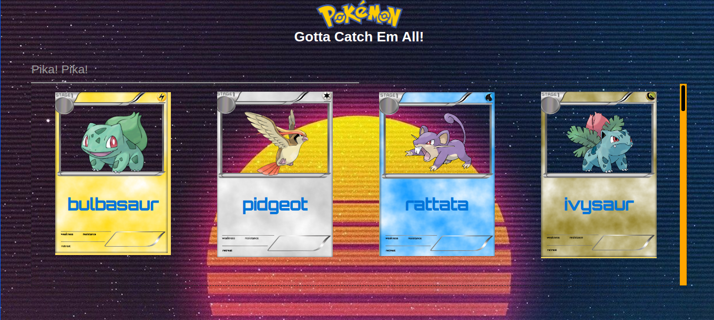
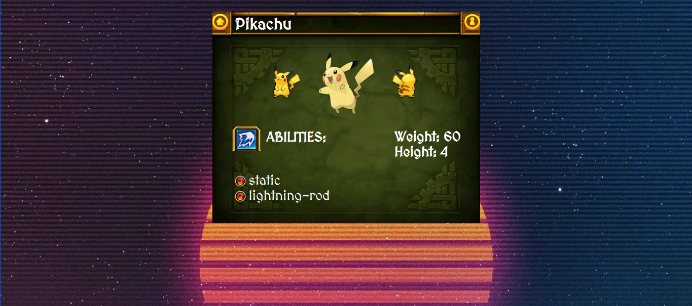
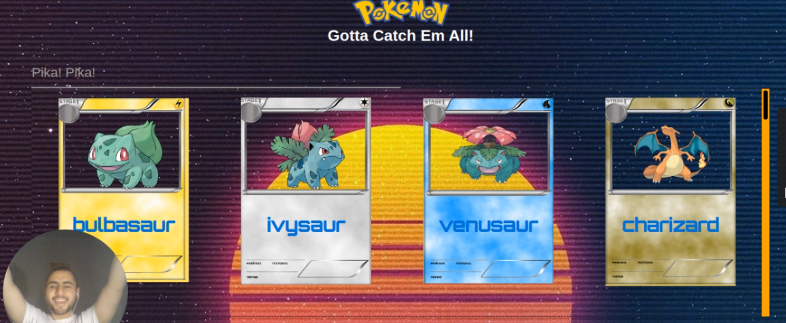

# Pokemon-Gallery

> A React-Redux project that displays pokemon cards using PokeAPI with cool vaperwave, sci-fi, and medieval style.
>  > 

The inspiration for the styling came while I was listening to a death metal song called "Lai Lai Hei" by a finnish band called "Ensiferum" which you can see on the medieval panel on the preview page that displays the poke's abilities, Then later I was listening to DOOM ETERNAL OST while I was riping and tearing some code I got the inspiration to use SCI-FI theme to display the cards. Lastly, I was relaxing with some Synthwave retrowave music and you can see this on the background image.

## Built with

- Node.js
- React
- React-DOM
- React-Router
- Thunk
- JEST
- React Testing Library
- React-Create-App
- Redux
- npm
- CSS
- ES6

## Video

[](https://gist.github.com/AbdelrhmanAmin/6b173a70b2107bedcae8549c95c50d66)

## Live Demo

[Live Demo Link](https://immense-everglades-28856.herokuapp.com/)

## Getting Started

To get a local copy up and running follow these simple example steps.

### Prerequisites

- A smile.

### Setup

1- Clone the repository

```
    git clone https://github.com/AbdelrhmanAmin/Pokemon-React-Capstone.git
```

2- Open the folder.

```
    cd Pokemon-React-Capstone
```

3- install the app

```
    npm install
```

4- Run the app

```
    npm start
```

5- Test the app

```
    npm test
```

## Author

😎 **Abdo Amin**

- GitHub: [@Abdelrhman-Amin](https://github.com/AbdelrhmanAmin)
- Twitter: [@Abdo Amin](https://twitter.com/AbdoAmi60489112)
- LinkedIn: [@Abdo Amin](https://www.linkedin.com/in/abdoamin/)

## Show your support

Give a ⭐️ if you like this project!

## Acknowledgments

- [Microverse](https://www.microverse.org/).
